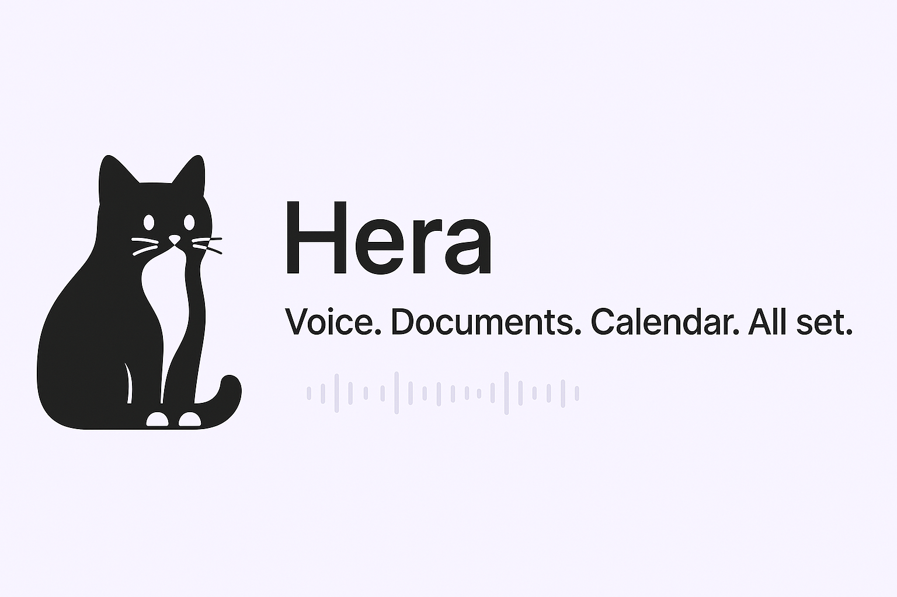
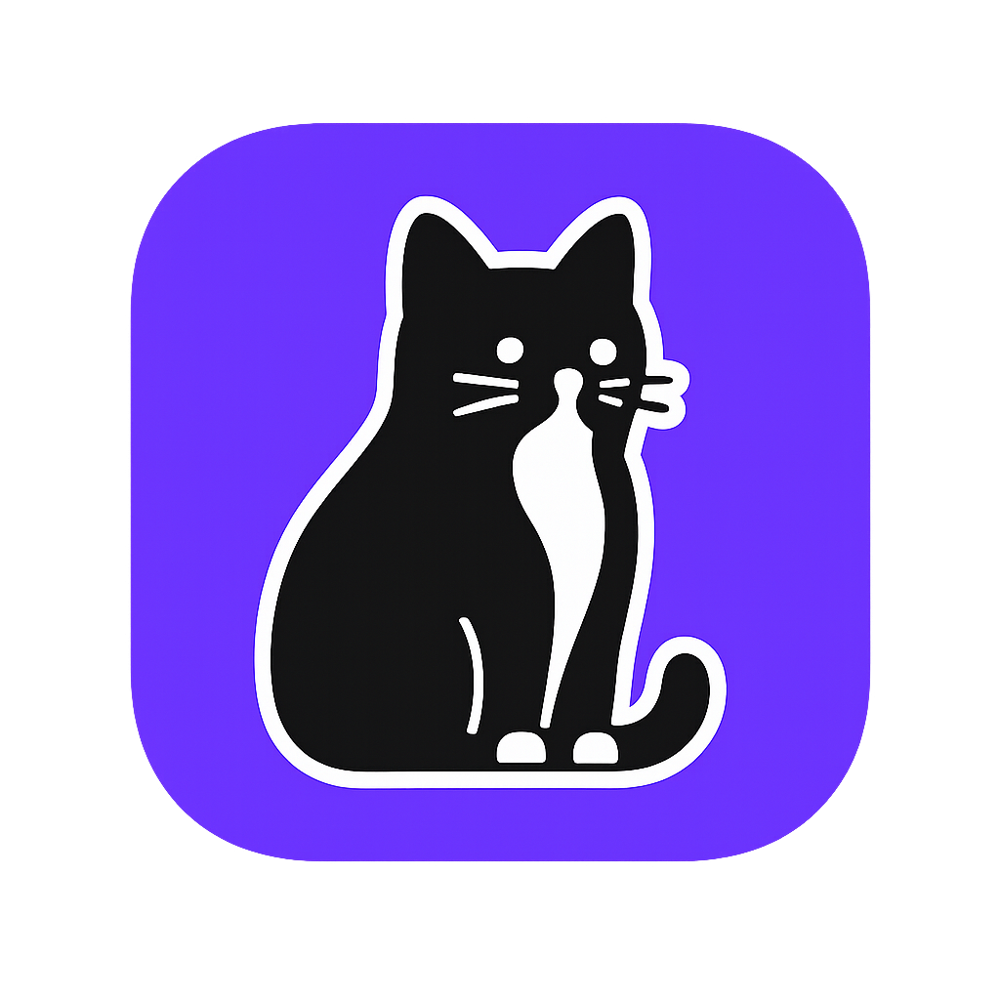

<p align="center">
  
</p>

# 🐾 Hera – Your Voice, Turned Into Action

<p align="center">
  
</p>

<p align="center">
  <a href="https://www.buymeacoffee.com/tofusito"></a>
  
  
  
</p>

**Minimalist AI voice note app, lovingly inspired by a tuxedo cat.**  
Capture your thoughts. Convert them into documents. Organize your life.

---

## ✨ What is Hera?

**Hera** is more than a voice recording app.  
It’s your intelligent, cat-powered productivity assistant — turning messy voice notes into structured documents, reminders, and calendar events — all in a calming, minimalist UI.

Inspired by Hera, my feline muse with perfect listening skills and zero tolerance for chaos, this app brings clarity to your thoughts and purrfection to your day.

---

## 🧠 What Can Hera Do?

- 🎙️ Record voice notes with visual feedback and high quality  
- 📝 Transcribe your recordings using OpenAI  
- 🧾 Generate full documents from your ramblings – summaries, structured notes, even meeting minutes  
- 📅 Detect calendar events and to-dos and suggest adding them to your system  
- 📤 Integrate with iOS Calendar & Reminders in one tap  
- 💾 Import audio from other sources and process it like magic  
- 🎨 Minimalist interface inspired by Hera’s quiet dignity  
- 🌗 Dark and light mode with adaptive pawprint themes

---

## ☕ Help Bring Hera to the App Store

Currently, Hera lives only on my iPhone, silently judging me and saving my productivity.

But to release it to the world, I need to join the Apple Developer Program (99€/year – yes, I cried too).

If this app sounds useful, charming, or at least less annoying than your own brain, consider supporting the launch:

### 👉 [Buy me a coffee so Hera can go global](https://www.buymeacoffee.com/tofusito)

<p align="center">
  <a href="https://www.buymeacoffee.com/tofusito">
    
  </a>
</p>

**Your support helps me:**
- 🚀 Publish the app on the App Store  
- 🧪 Add new features, polish existing ones  
- 🐛 Feed the developer (me, not Hera)  
- 🧼 Keep the UX clean and cat-approved

---

## 🛠️ Tech Stack & Architecture

### 🔧 Core Technologies

- Swift & SwiftUI – for beautiful native UI  
- SwiftData – clean local data persistence  
- AVFoundation – audio recording & playback  
- OpenAI API – for transcription, summarization, and content generation

### 📂 File Structure

Each recording is stored in a self-contained folder:

```
UUID/
├── audio.m4a
├── transcription.txt
├── document.md
└── analysis.json
```

### 🧩 MVVM Structure

- `AudioRecording`: SwiftData model for voice notes  
- `DisplayableRecording`: View-ready struct with metadata  
- `AudioManager`: Handles recording, playback, folder structure  
- `TranscriptionService`: Sends audio to AI and parses response  
- `InsightEngine`: Suggests calendar events, reminders, and actions

---

## 💡 Smart Features

### 🧾 Document Generation

Turn voice notes into:
- Blog drafts  
- Meeting minutes  
- Daily journals  
- Cleanly formatted Markdown documents

### 📆 Event & Reminder Detection

Say things like “remind me to call Alex on Friday” or “meeting at 3pm with Marta” and Hera will:
- Detect it  
- Suggest it  
- Let you add it to your Calendar or Reminders with one tap

### 🌈 Adaptive UI

- Light/Dark mode with cat-themed details  
- Pawprint icon shifts color based on system appearance  
- Smooth visualizers while recording/playback

---

## 🚀 Getting Started

1. Clone the repo  
2. Open in Xcode  
3. Add your OpenAI API key  
4. Build & run on device (free provisioning is supported!)

> 🧠 **Note on API Keys**  
> Hera does not come with any AI API keys included.  
> You’ll need to generate your own API key from [OpenAI](https://platform.openai.com/account/api-keys) and paste it into the app’s settings screen.  
> Your key is stored locally on your device — never uploaded or shared — and can be removed anytime.

---

## 🐈 Who’s Hera?

Hera is my tuxedo cat. She listens more than most humans.  
She inspired this app with her calm presence, sharp focus, and general refusal to tolerate nonsense.  
So I built an app that pays attention like she does.

---

## 🛣️ What’s Next?

- ☁️ iCloud sync  
- 📄 Export to PDF  
- 🔗 Share recordings & docs with friends  
- 🐈 Animated Hera mood tracker (yes, seriously)

---

## 📝 License

MIT – use it, fork it, just don’t sell it and call it your cat.

---

**Made with ❤️, 🍵 and 🐾 by [Manuel Gutiérrez](https://www.buymeacoffee.com/tofusito)**

